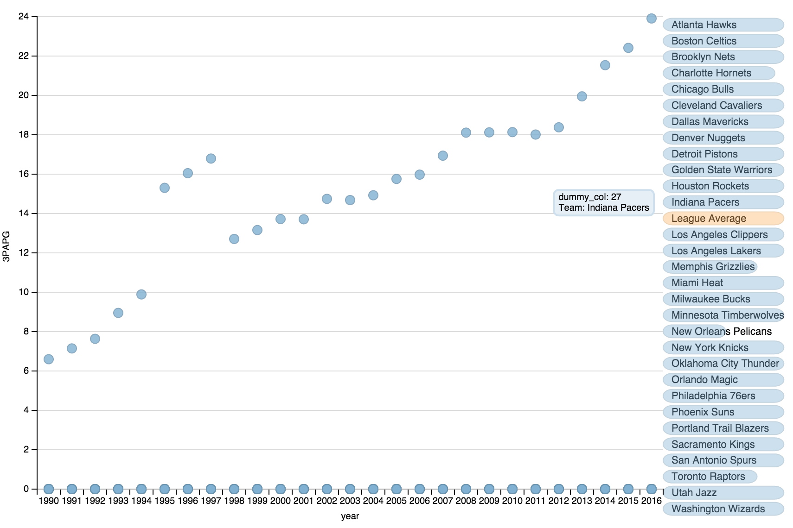
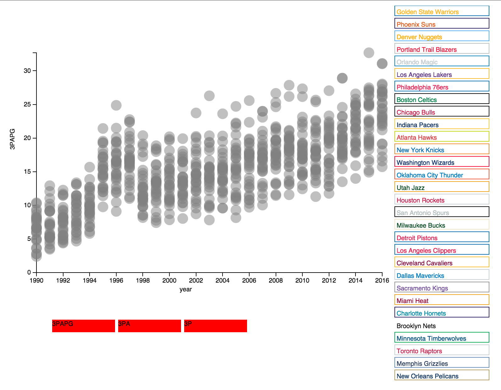
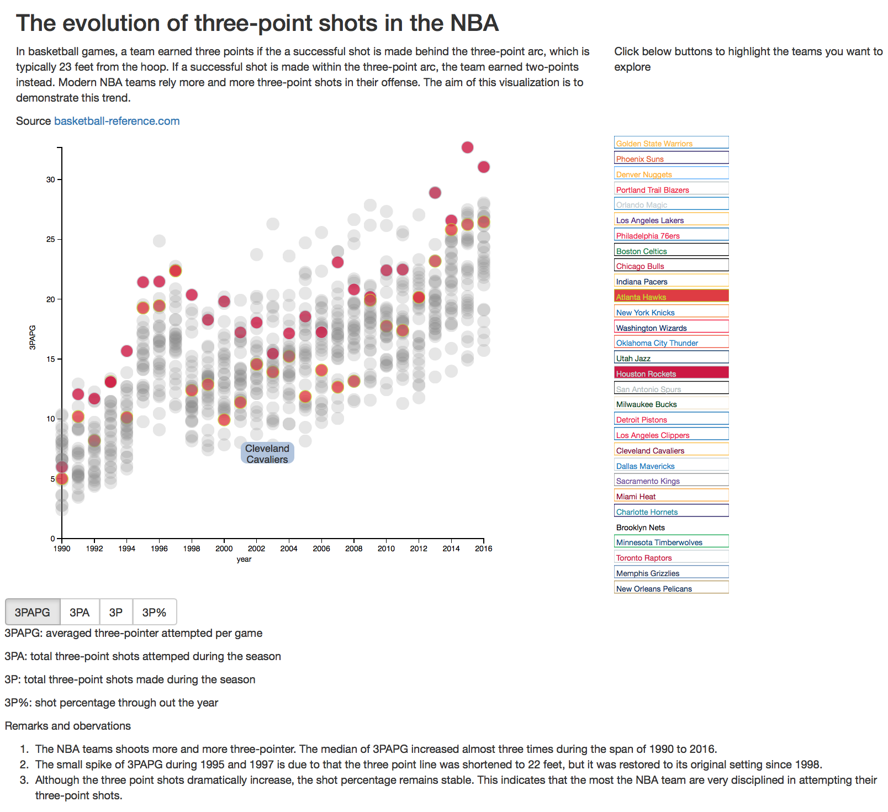
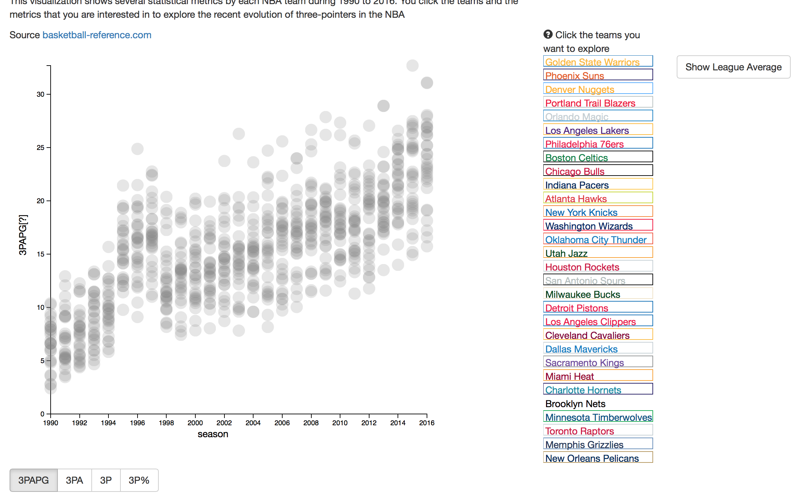

# Data Visualization: The evolution of three-point field goals in the NBA

Visualization page: [http://kanhua.github.io/udacity-dand-data-vis/](http://kanhua.github.io/udacity-dand-data-vis/)

## Summary
Basketball fans may be aware that NBA teams are shooting more and more three-point field goals. The project aims to visualize the evolution of three-pointers in the NBA. This visualization allows readers to explore and compare several three-pointer statistics of each NBA team since 1990. 

#### Background information
#### Three-point field goals
In basketball games, a team earned three points if the a successful shot is made behind the three-point arc by the player,
which is typically 23 feet from the hoop. If a successful shot is made inside the three-point arc,
the team earned two-points instead. For every offense opportunity, a team can choose to make a two-point shot or three-point shot.
            
##### Should you take the risk and shoot the three-pointer?
In short, the dilemma that the basketball players are facing is:
should you take greater risk, shoot the ball further from the basket that potentially gives you three points? 
or should you shoot the ball near the basket but only get two points?

## Design
Since we would like to investigate how the team statistics related to three-point field goals evolves with time, a X-Y scatter plot serves this purpose well.
Also, assigning different colors to each time at once makes the plot very busy. Instead, we let the readers select the teams that they want to highlight. The readers are also able to select which statistics to show.

#### V0
The initial version was made by modifying [this example](http://dimplejs.org/advanced_examples_viewer.html?id=advanced_storyboard_control) provided on dimple.js official website.

#### V1
Major changes in this version:
- Instead of using dimple.js, this version were rewritten by just using D3.
- This version allows the readers to highlight the teams that they are interested in and compare it with other teams.
- The readers can also select the statistics (3PAPG, 3PA, 3P,3P%) shown on the plot by pressing the red buttons below the chart.
- The colors of each team are set to be consistent with the color codes of NBA teams.

#### V2
Major changes in this version:
- Use [Boostrap](http://getbootstrap.com) to rearrange the layout.
- Replace the red rectangle buttons in V1 by Bootstrap buttons.
- Add title, background information, and discussions in the figure.
- Add tooltips for the data points.

#### V3 (the current version)
Major changes of this version:
- The background information and explanations are enhanced.
- A tooltip is added to the y-axis so that readers can quickly check the definition of each statistics.
- A new button is placed to let the reader show the "League Average".
- Minor revisions of the layout and texts.

## Feedback

#### Comments for V0:

(Oral communication with reviewer #1)

Comments|Responses
--------|---------
It would be good to see how the statics of a single team compared with other teams.| This was implemented in the next version.
The chart will be more attractive to NBA fans if the colors of each team in the figure can match the color codes of NBA team uniforms.| This was implemented in the next version.

#### Comments for V1:

(Oral communication with reviewer #2)

Comments|Responses
--------|--------
The readers need some explanation of what 3PAPG, 3PA and 3P represent|Explanations and background information are added in this version.
The red button below the chart does not look very good.| The red rectangles are replaced by buttons.

#### Comments for V2:
The original version of comments for this version can be found on [this post](https://discussions.udacity.com/t/project-6-the-evolution-of-three-pointers-in-the-nba/44016) or this [backup version](./feedback_charlie.md).

Comments | Responses
---------|---------
The meaning of the four statistics are not clear.| These information were rewritten to make it clearer.
The provided background information and explanation is not sufficient for some who are not familiar NBA or basketball. Also, the motivation of presenting this study is not clear.| More background information is added in the page.
The tooltip on the data point are not very useful | I think the tooltip is still useful for knowing which teams are the outliers, so I decide to keep it. 
Although the definitions of the y labels are provided in the bottom of the figure, it would increase readability if these definitions can be put directly on the chart| A tooptip is added onto the y label, allowing the reader to see the definition of y label without scrolling down the page.
The color of Utah Jazz is too dark. | The color code of Utah Jazz is updated.
It would be interesting to see the mean or median values.| A new button that shows the mean values is added.
Questions about the data: What happened to 3PA and 3P in 1999 and 2016? | The reason is provided in "remarks" section.
Using grey as the default color of the data points makes the chart looks depressing.| The new version keeps grey as the default color but adds colored "league average", so the reader's can be better guided.

## Resources
- Source of data: [basketball-reference.com](http://basketball-reference.com)
- Color codes of team: [Team Color Codes](http://teamcolorcodes.com)
- Basketball court chart: [Basketball diagrams](http://li16-138.members.linode.com/sportsdiagrams/BasketballDiagrams.html) 
