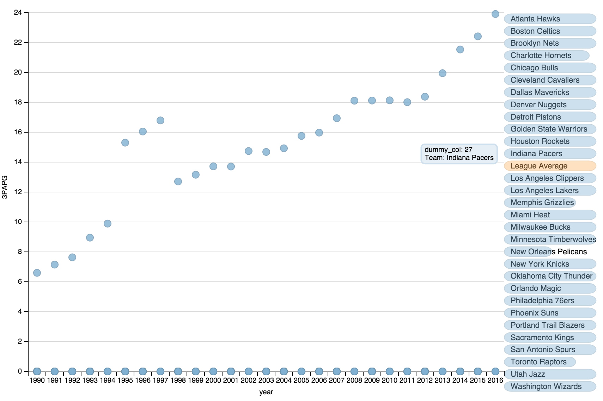

## Summary
Basketball fans may be aware that NBA teams rely more on 3-pointers. The 2015 NBA champion team, Golden State Worriors, is the most representative team of this 3-pointer evolution.
The project tends to visualize the trend the evolution of 3-pointers in the NBA. This visualization allows users to explore and compare a number of 3-pointer statistics of each NBA team since 1990. 

#### Background information
In a basketball game, you typically get two points or three points when you shot the ball into the net, which is called as a "field goal". You can get three points if you shot behind the three-point line, which is around 23 feet from the hoop. The history and evolution of three-point lines can be found in this [wiki article](https://en.wikipedia.org/wiki/Three-point_field_goal).

## Design
In this visualization, I would like to present some offense statistics of each team from 1990 to 2016. I want the users are able to select which team team to plotted on the main chart.

#### First version
The initial version was made by modifying [this example](http://dimplejs.org/advanced_examples_viewer.html?id=advanced_storyboard_control) provided on dimple.js official website.

According to the feedback, I want to add the following features:

1. The statstics of the selected team can be compared with all the NBA teams.
2. The color codes of each team can be consistent to the NBA teams. 

Since these features cannot be implemented by the APIs of dimple.js, we turned back to D3 and start from scratch.

#### Second version

## Feedback

## Resources
- Source of data: [basketball-reference.com](http://basketball-reference.com)
- Color codes of team: [Team Color Codes](http://teamcolorcodes.com)
